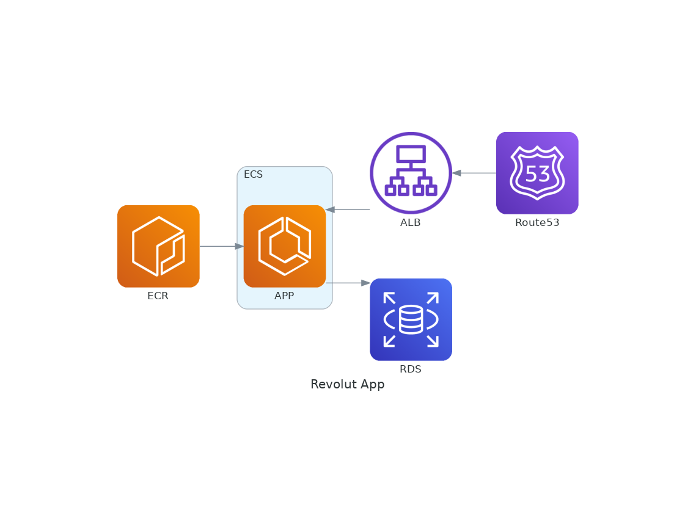

# Flask + Python3 app

Application for Revolut test, this application has a database on Mongodb and one api to get and to put information about Mongo database.

##  Diagram

To create the diagram, I have used a little script to generate it with diagram. 

### How to work?

Basically, it needs to install the requirements.txt about python environment and execute the diagram.py script:

1. `python3 -m venv .venv && source .venv/bin/activate && pip -r requirements.txt`

2. `python3 diagram.py`

With these steps will generate the following diagram:

## Application

There are two important script, getenv.py where I have defined the environment variables, and main.py where I have defined all the application logic.

### How to work

Basically, it needs to install the requirements.txt about python environment, define the script for flask, define the variable for the database and execute the service on local or on docker-compose:

1. `python3 -m venv .venv && source .venv/bin/activate && pip -r requirements.txt`

2. `export FLASK_APP=main.py && export MONGO_INITDB_HOST_NAME=localhost` or `export FLASK_APP=main.py && export MONGO_INITDB_HOST_NAME=`

3. `docker-compose up -d ddbb && flask run -h 0.0.0,0 -p 5000` or `docker-compose up -d`

### How to connect

To register on app:

- `curl -X POST app:5000/hello/dani -H 'Content-Type: application/json'    -d '{"BIRTHDAY":"1991-05-15"}`

To get to app:

- `curl -X GET localhost:5000/hello/dani -H 'Content-Type: application/json'`